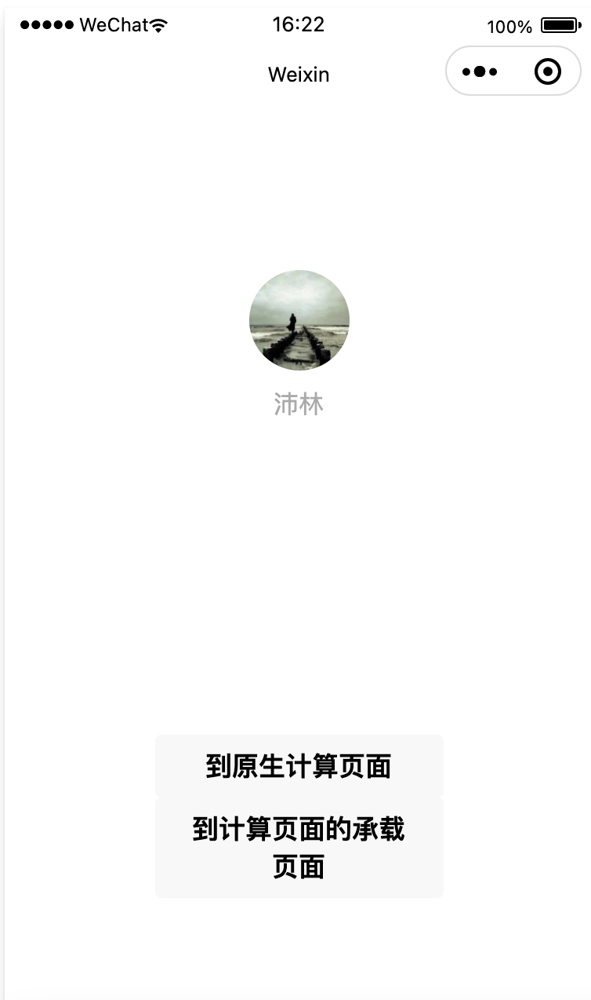
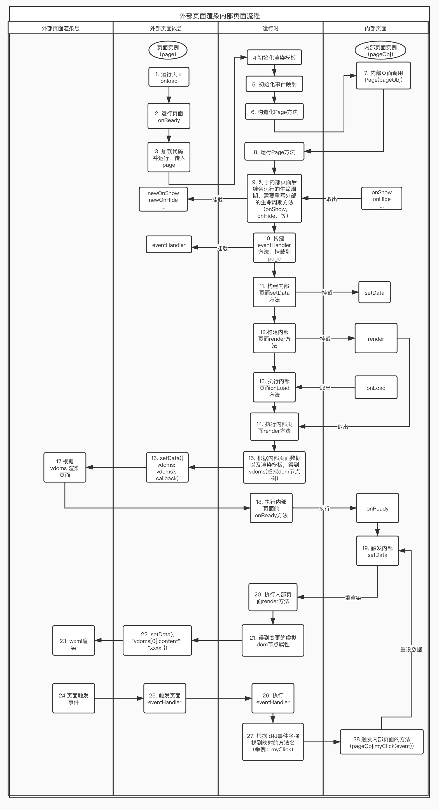

# mini-wxml-render
# 高性能动态渲染页面方案
`mini-wxml-render` 可以让你的小程序页面wxml，和你的页面js逻辑整合到一起，通过另外一个页面渲染，在可以动态加载js的前提下，实现小程序页面的热更新。

原理上就是将wxml编译成一个渲染模板，并构建出一个渲染函数，传入数据可以得到一颗虚拟dom树，将虚拟dom树通过setData放到页面结构上，就可以将页面渲染出来。在数据更新的时候，找到虚拟dom树的更新属性，在通过setData就可以更新页面上。

为什么说是高性能呢？ 因为在数据更新的时候，只更新了影响到的节点，对于不会影响到的节点或属性都没有检查，时间复杂度为o(i)【假设虚拟dom树的节点为n,静态节点为m,某个属性变化导致的页面渲染变化节点为i(i<=(n-m))】


它包含3部分:
1. wxml解析器： 将wxml解析成ast树，处理表达式为function，传入data可以得到表达式结果，得到一个渲染模板，遍历渲染模板传入数据，即可构建一颗虚拟dom树。同时也会收集页面使用到的属性名，用于后续属性监听。
2. 承载页面生成器： 分析原有页面对外部文件的依赖，生成一个外部承载页面，引用原有页面的依赖，调用渲染js的方法，并传入页面实例和依赖。
3. 承载页面和内部页面连接桥：运行内部页面逻辑，并通过setData设置内部页面的虚拟dom节点树到外部页面。并在内部页面数据更新的时候找到虚拟dom树的最小变化节点，再通过setData设置到外部页面，更新页面。

> 当前项目不具备动态加载js能力

## 快速体验
```javascript
npm run start
```
使用开发者工具打开小程序：`example-mini`


进入主页面后可以按钮进入原生页面，或者进入承载页面

## 命令行编译
通过命令行快速编译页面，生成一个承载页
```shell
npm install -g mini-wxml-render
# 创建一个gen-page-config.json文件
mini-wxml-render genVmPage ./gen-page-config.json
```
gen-page-config.json 示例如下：
```json
{
  "distPagePath": "./dist-page", // 页面编译后的js文件存放位置
  "version": "1.0.0", // 版本号
  "needGenPageList": [
    {
      "pageJsPath": "./example-mini/pages/calculate/calculate.js" // 需要编译的页面
    }
  ]
}
```

## 交互性能优化方案
如果只是渲染一次页面，不考虑数据变化，是很简单的，只要将wxml编译成一份渲染模板，传入数据就可以得到一颗虚拟dom树，就没有变化数据这一说法。

但是如果考虑数据变化的话，是不是每次都要将变化后的全部数据传入渲染模板，将全部节点都再遍历一遍，得到一颗新的虚拟dom树，然后再和原本的虚拟dom树做对比，找到更新的属性。如果直接设置整颗新的渲染树到页面，会导致页面的重绘，滚动条会滚动到顶部，用户体验会不好。

假设虚拟dom树的节点为n,构建虚拟dom树的时间复杂度为o(n),和原本的虚拟dom树做对比，时间复杂度为o(n),总共时间复杂度为o(n)。
### 优化方向
1. 虚拟dom树的节点，有不少是静态节点，**无论数据怎么变化，这些静态节点都不会变化**，所以可以将会变化的节点收集起来，在数据有变更之后，只检查这些节点是否有更新。（参考vue3的一个优化点）
   
假设虚拟dom树的节点为n,静态节点为m,变化节点为n-m, 检查页面更新时间复杂度为o(n-m), m越大时间复杂度会越小。

2. 进一步优化，**数据的某个属性变更，并不会导致全部节点的更新**。如果可以收集到数据某个属性变化时影响到的节点，那就可以减少检查次数。(参考vue2的变化检测)

假设虚拟dom树的节点为n,静态节点为m,某个属性变化导致的页面渲染变化节点为i(i<=(n-m)),检查页面更新时间复杂度为o(i) <= o(n-m)

### 数据变化之后，只检查含有表达式的节点
一颗虚拟dom树，有不少节点都是静态的，如果用传统的虚拟dom树diff，会把整棵树都遍历一遍。

所以可以把一些会变化的节点属性存储起来，然后在数据变化的时候，就只检查这些会变化的节点。

比如说下面的html标签，只有第3层view的内容是变化的，其他都是不变的，都不需要遍历。
```html
<view>
  <view>我是第二层view</view>  
  <view>我是第三层view{{showData}}</view>
</view>
```
将上述html转化为js初次渲染模板如下，以及根据首次渲染模板得到的再次更新模板结构如下
```javascript
// 首次渲染模板
[
  {
    "tagName": "view",
    "attributes": [],
    "children": [
      {
        "tagName": "view",
        "attributes": [],
        "children": [
          {
            "content": "我是第二层view",
            "uid": 3
          }
        ],
        "uid": 2
      },
      {
        "tagName": "view",
        "attributes": [],
        "children": [
          {
            "content": function (data){
                        var res = "";
                        try{
                            res = "我是第三层view"+(data.showData)+""
                        }catch(e){
                            console.warn(`执行："我是第三层view"+(data.showData)+""，失败`, e?.message)
                            // console.warn("错误：", e)
                        }
                        return res
                    },
            "uid": 6
          }
        ],
        "uid": 5
      }
    ],
    "uid": 0
  }
]
// 再次渲染模板
{
  'vdoms[0].children[1].children[0].content': { 
    pre: '我是第三层view我是showData', 
    render: function (data){
              var res = "";
              try{
                  res = "我是第三层view"+(data.showData)+""
              }catch(e){
                  console.warn(`执行："我是第三层view"+(data.showData)+""，失败`, e?.message)
                  // console.warn("错误：", e)
              }
              return res
          },
  }
}
```

### 根据数据变化，更新影响节点
上述再次渲染模板的render，包含了showData这个属性key，意味着，如果data.showData 的变化会影响到这个key'vdoms[0].children[1].children[0].content'的更新。
```javascript
// 如果修改了data.showData
this.setData({
  showData: "我是新的showData"
})
// 通知节点更新 showData这个属性影响到的key
// node 是节点树 nextUpdateKeys 是下一次要更新的属性key
node.nextUpdateKeys.push("vdoms[0].children[1].children[0].content")
```
## 目前已做
1. 编译wxml为渲染模板，并收集页面数据引用到的属性名，以及事件名
2. 构建渲染wxml,可以根据虚拟dom树渲染页面
3. 构建运行时的Page方法，连接内部需要渲染的页面和外部承载页面
4. 根据页面数据变化，找到影响的渲染节点属性，优化交互性能。
5. 目前只支持简单页面，具体标签下面有说明，后续会支持其他标签
6. 支持wxs, dataset

## 目前支持的标签
```
 view text button input scroll-view image icon block
```
## 待做
- [ ] dataset 只在逻辑层处理,不设置到渲染层
- [ ] wxFor节点紧跟着的节点处理
- [ ] 支持其他标签，比如说template
- [ ] 支持解析表达式为对象的语法，比如说：data="{{title: "xxxx"}}"
- [ ] 编译小程序示例demo的文档
- [ ] 支持15层以上的节点
- [ ] 支持编译组件
- [ ] 优化view节点，区分静态节点，含有事件的节点
- [ ] 自动分析页面的自定义组件，增加到渲染模板上

### 修改wxml和js可以优化页面渲染性能的点
1. wxFor 不和wxIf 同时使用。如果wxFor的节点是隐藏的，则可以在逻辑层做一层过滤，setData 到页面的数据就剩下全部都要渲染的了，小程序端是双线程处理，两个线程之间的需要通过通信传递数据，setData的数据需要通过序列化和反序列化两步操作，如果setData数据减少，处理的时间也会较少，尽量保证渲染页面只处理需要渲染的数据。
```html
<view wx:for="{{list}}">
  <view wx:if="{{item.status}}"></view>
</view>
```
2. wx:if 和 wxElse 尽量不应用在节点结构相同的情况。比如说：
```html
<view wx:if="{{item.id === 'xxxx'}}">
  <view class="xxx">-</view>
  <button>按钮</button>
</view>
<view wx:else>
  <view class="xxx">{{item.value}}</view>
  <button>按钮</button>
</view>
```

3. 尽量不要修改渲染的元数据，每次setData都是设置一份新的数据，比如说：
```javascript
// 第一次setData
this.list = [{name: "plinghuang", age: 66}]
this.setData({
  list: this.list
})
// 再次setData
this.list.foreach(item => {
  item.age = item.age+1
})
this.setData({
  list: this.list
})
```
如果存在这中情况，必须在setData的时候把对象深复制一遍，这样才能检测到数据变更。
因为如果去检查原本 this.data["list"] 会发现和setData 的list是相等的，无法知道是否有变化。
如果不存在这样的情况，在每次setData的时候就不需要深复制，可以进一步提高性能。

## 代码运行流程图

## Change Log

### 2021-09-26
* 处理在mac系统下打开小程序无法加载页面问题

### 2021-09-18
* 增加两个性能优化方案的详细说明
### 2021-09-17
* 修复treeNode.id为undefined
### 2021-09-16
* 完成功能代码抽离，并上传
* 发布到npm 并增加使用说明
### 2021-09-14
* 处理内部页面直接修改内部数据，并setData数据地址的问题
### 2021-09-13
* 设定生产环境，缩短虚拟dom的属性名称
* 思考串行运行setData的可行性，并实际测试效果，效果不理想，增加了交互耗时
### 2021-09-10
* 增加对wxForItem对象使用到的属性名进行监听
### 2021-09-10
* 编译时收集wxForItem对象用到的属性名
### 2021-09-08
* 优化首次渲染的逻辑，page.onReader 和 pageOnShow 放在setData回调中执行
### 2021-09-06
* 抽离最小化更新逻辑到page-diff.js 文件
### 2021-08-23
* 处理wxfor下的节点 数据有更新则检查全部的更新
### 2021-08-19
* 增加page.data数据监听，在属性变化之后通知影响到的节点更新特定key（XR：300ms=> 100ms）
### 2021-08-17
* 收集页面渲染使用到的数据属性，排除wxs,wxForItem
### 2O21-08-13
* 减少Object.keys 的使用，用空间换时间，减少运行时间
### 2021-08-11
* 完善wx:for的初次渲染和再次渲染逻辑
### 2021-07-30
* 区分初次渲染和再次渲染，只处理节点会更新的属性，不进行整颗渲染树的对比（XR: 1000ms => 300ms）
### 2021-07-08
* 深度对比两个虚拟dom树，找出更新的属性，多层属性名拼接，最后setData({"xxxx.xxx.xxx": "xxx"}) (XR: 1000ms)
### 2021-06-22
* 处理dataSet的设置值，和取值
### 2021-06-15
* 处理 wx:for 逻辑
### 2021-06-08
* 处理wx:if wx:elif wx:else 逻辑
### 2021-06-06
* 增加事件代理，将全部事件代理到同一个function，通过id+事件名找到真正需要触发的函数名
### 2021-06-05
* 增加生成承载页逻辑
### 2021-06-04
* 增加初步解析wxml逻辑
### 2021-05-29
* 思考通过承载页面渲染内部页面方案
## 参考
1. (taro 编译产物的 base.wxml)[https://github.com/nervjs/taro]
2. (vue3 静态节点不处理，只处理有数据变更的节点)[https://github.com/vuejs/vue]
